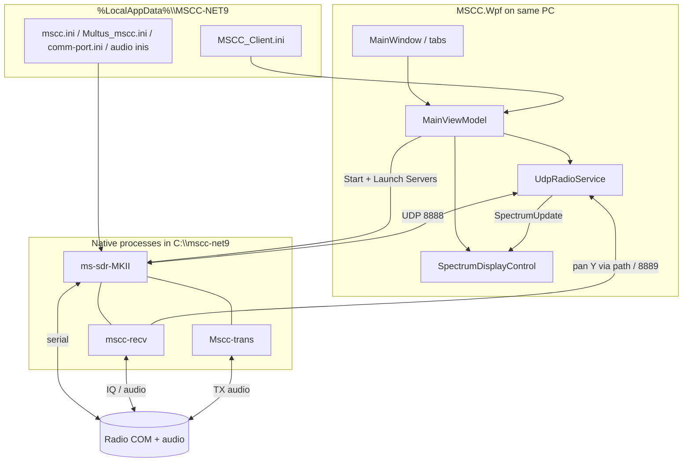
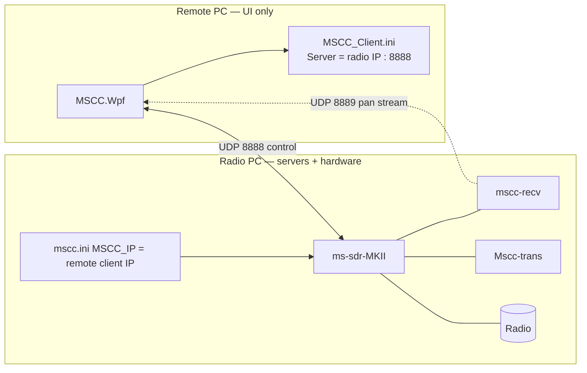
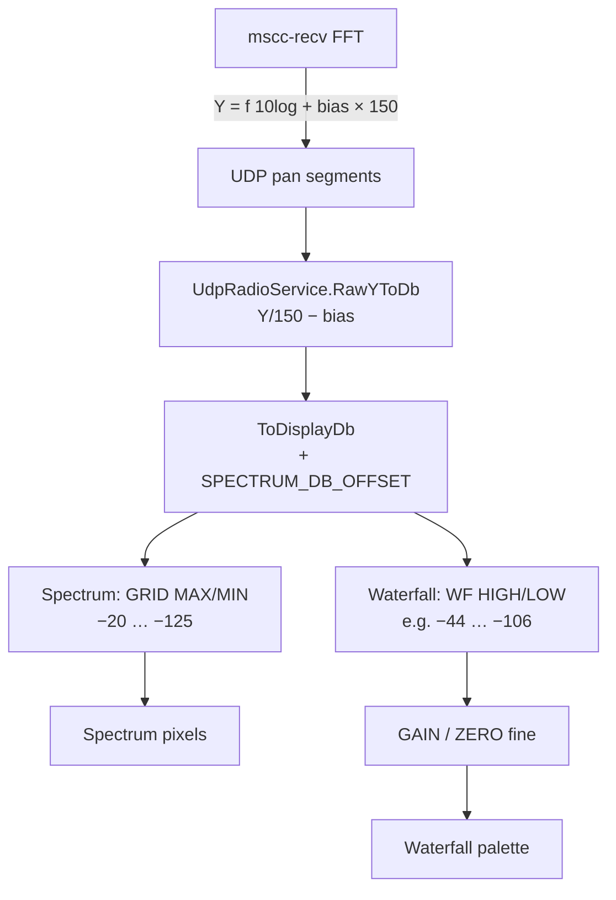

# MSCC Architecture Guide

A practical map of how Multus MSCC pieces fit together — **standalone (local)** and **remote** — and **where to change code** for features and bugs.

> **Audience:** operators and developers following product work (spectrum, waterfall, UI, servers).  
> **Deploy root:** usually `C:\mscc-net9`  
> **Client settings:** `%LocalAppData%\MSCC-NET9\` (especially `MSCC_Client.ini`)

---

## 1. The big picture (one sentence)

**Hardware ↔ native server processes (on the radio PC) ↔ UDP opcodes ↔ .NET client (UI + display).**  
The client never talks to the radio COM port or sound card DSP directly; the **servers** own that.

```
┌─────────────────────────────────────────────────────────────────────────┐
│                         MSCC.Wpf (this app)                              │
│  MainWindow / tabs  →  MainViewModel  →  SpectrumDisplay / meters       │
│         │                    │                                           │
│         │                    ▼                                           │
│         │            MSCC.Core: UdpRadioService                          │
│         │                    │  (opcodes, panadapter Y→dB, keep-alive)   │
│         └────────────────────┼───────────────────────────────────────────┘
│                              │  UDP
│                    8888  control / status     8889  panadapter stream
│                              │
┌──────────────────────────────┼──────────────────────────────────────────┐
│  RADIO PC  (local = same machine; remote = only this PC runs servers)    │
│                              ▼                                           │
│   ms-sdr-MKII.exe  ←── master state machine, GUI protocol, COM to radio │
│        │                                                                 │
│        ├── mscc-recv.exe   RX DSP, panadapter FFT → Y bins              │
│        └── Mscc-trans.exe  TX audio / TX path                           │
│                                                                          │
│   Config: %LocalAppData%\MSCC-NET9\  (mscc.ini, comm-port.ini, …)       │
│   Hardware: Proficio / Geminus serial + audio devices                     │
└──────────────────────────────────────────────────────────────────────────┘
```

---

## 2. Layer cake (bottom → top)

| Layer | What it is | Lives in | Change when… |
|-------|------------|----------|--------------|
| **0. Hardware** | Multus radio, serial, sound | Physical box | Hardware / drivers only |
| **1. Native servers** | DSP, panadapter, TX, radio control | `mscc-recv`, `ms-sdr-MKII`, `Mscc-trans` (C, `SDRcore-recv`, etc.) | FFT/bias/Y scale, DSP bugs, COM behavior, pan packet format |
| **2. Protocol** | UDP opcodes + binary packets | `MSCC.Core` (`Opcodes`, `UdpRadioTransport`, `UdpRadioService`) | New radio command, pan decode, keep-alive, connect path |
| **3. Domain state** | VFO, mode, filters, band | `MSCC.Core` (`RadioState`, `VfoState`) + `MainViewModel` | What “mode USB” *means* in memory |
| **4. UI / ViewModel** | Buttons, modes, power, tabs | `MSCC.Wpf` (`MainViewModel`, `MainWindow`) | Feature UX, mode profiles, start/stop, remote IP |
| **5. Display** | Spectrum / waterfall pixels | `SpectrumDisplayControl`, `SpectrumColorSettings` | Grid, dB cal, WF High/Low, colors |
| **6. Persistence** | INI / last-used / favorites | `SpectrumWaterfallSettings`, `ConfigBootstrap`, AppData | Sticky settings, HF/LF banks, install seed |

**Rule of thumb:**  
- *Looks wrong on spectrum/waterfall but radio still works* → layer **5** (sometimes **2** if Y→dB is wrong).  
- *Button does nothing / wrong mode / wrong filter* → layer **4** then **2**.  
- *No pan / flat noise / server crash* → layer **1**.  
- *Remote can’t connect* → network + **6** (`MSCC_IP` / ports) + **2** (launch vs connect-only).

---

## 3. Processes and roles

| Process | Role | Must run where |
|---------|------|----------------|
| **MSCC.Wpf.exe** | GUI, settings, starts or joins servers | Local PC and/or remote PC |
| **ms-sdr-MKII.exe** | “Brain”: serial to radio, orchestrates recv/trans, answers GUI UDP | **Radio host only** |
| **mscc-recv.exe** | RX IQ / DSP / **panadapter** (builds Y array) | **Radio host only** |
| **Mscc-trans.exe** | TX audio path | **Radio host only** |
| **mscc-init.exe** (legacy) | Older one-time init; largely replaced by client seed | Optional / install |

Client can **Launch Servers** (spawn the three) or **connect only** (UDP to a host that already runs them).

---

## 4. UDP traffic (the only link above the servers)

| Port | Direction (typical) | Content |
|------|---------------------|---------|
| **8888** | Client ↔ ms-sdr | Control: mode, freq, filters, PTT, meters, keep-alive (`0xF4`), versions, … |
| **8889** | ms-sdr / recv → client | **Panadapter** segments (Y samples); client assembles → `SpectrumUpdate` |

Client settings (`MSCC_Client.ini`):

- `PROFICIO_DLL_IP` / host + port **8888** (what the UI connects to)  
- Server-side host files also have `MSCC_IP` / `MSCC_PORT` so **ms-sdr knows where to send GUI replies and pan** (must be the client’s reachable address).

**Local default:** both sides use `127.0.0.1`.  
**Remote:** client points at radio PC IP; radio PC `MSCC_IP` must be the **remote client’s** IP (not a wrong hostname). Starlink / CGNAT / host isolation can block this even if “Start” looks fine.

---

## 5. Standalone (one PC) flow



### Startup sequence (typical local)

1. **ConfigBootstrap** seeds AppData from `C:\mscc-net9\init-files` if needed; forces local host names for loopback.  
2. **SpectrumWaterfallSettings.Load()** → grid, dB cal, waterfall HF/LF banks, mode filter profiles.  
3. User **Start** with **Launch Servers** checked:  
   - Client spawns **ms-sdr**, **recv**, **trans** from app directory.  
   - Opens UDP to `127.0.0.1:8888`.  
   - Signals GUI ready; keep-alive begins.  
4. **ms-sdr** drives radio + tells recv to produce pan.  
5. Pan packets → **UdpRadioService** (`RawYToDb`) → **MainViewModel** enriches (freq, filters, grid) → **SpectrumDisplayControl** paints spectrum + waterfall.

### Standalone “where do I edit?”

| Symptom / feature | First place to look |
|-------------------|---------------------|
| Spectrum floor / cal / ticks | `SpectrumColorSettings`, `SpectrumDisplayControl`, S/W window, `UdpRadioService.RawYToDb` |
| Waterfall contrast HF/LF | `WaterfallHigh/Low`, HF/LF banks in `SpectrumWaterfallSettings` |
| Pan Y formula / bias | **mscc-recv** `dsputils.c` (+ matching client inverse) |
| Mode / filter / band buttons | `MainViewModel` (+ `MODE_*` in client INI) |
| COM port / audio device | Settings panels → AppData inis; **ms-sdr** reads them |
| Start / Launch Servers | `MainViewModel`, `UdpRadioService` start path, `ConfigBootstrap` |

---

## 6. Remote (two PCs) flow

**Idea:** only the **radio PC** runs native servers; the **remote PC** runs UI only and talks UDP over the LAN/VPN.



### Remote checklist

| Item | Radio PC | Remote PC |
|------|----------|-----------|
| Run **ms-sdr / recv / trans** | Yes | No |
| **Launch Servers** on Start | Yes (or already running) | **Off** (connect only) |
| Client Server address | `127.0.0.1` if local GUI | Radio PC LAN IP |
| `MSCC_IP` in server inis | **IP of remote client** (reachable from radio PC) | — |
| Firewall | Allow 8888/8889 in | Allow outbound / replies |
| Network | Same LAN or working VPN; **not** isolated Starlink peer-to-peer without routing | |

If control works but spectrum is blank → pan (8889 / `MSCC_IP`) or firewall.  
If nothing works → host, port, Launch Servers off, keep-alive / host isolation.

---

## 7. Spectrum / waterfall data path (the “above the servers” part you care about)

This is where most recent product work lived.



| Concept | Meaning | Stored |
|---------|---------|--------|
| **bias** (server + client) | Sets digital floor of Y=0 | Code: recv + `RawYToDb` (must match) |
| **dB CAL** | Absolute level offset; UI “0” = center −91.3 | `SPECTRUM_DB_OFFSET` |
| **GRID MAX/MIN** | Spectrum pane window only | `SPECTRUM_GRID_*` |
| **WF HIGH/LOW** | Color window only (not spectrum height) | `WATERFALL_HIGH/LOW` + **HF/LF banks** |
| **Proficio / Geminus** | Swaps HF vs LF waterfall banks | `RADIO_MODEL`, `WATERFALL_HF_*`, `WATERFALL_LF_*` |

**Bug class reminder:** S/W sliders must not write INI during window load (WPF default ValueChanged). Handlers attach after restore.

---

## 8. Client software map (folders)

```
mscc-new/src/
  MSCC.Core/                 # No WPF — protocol + services
    Protocol/                # UDP framing, opcodes
    Services/UdpRadioService.cs   # Talk to ms-sdr, pan assemble, RawYToDb
    Domain/                  # RadioState, VfoState
    Display/SpectrumUpdate.cs

  MSCC.Wpf/                  # UI
    MainWindow.xaml(.cs)     # Layout, band/radio-model buttons, chrome
    ViewModels/MainViewModel.cs   # Almost all operator logic
    Controls/SpectrumDisplayControl.xaml.cs  # Draw spectrum + waterfall
    Controls/SpectrumColorSettings.cs        # Live display settings
    SpectrumWaterfallSettings.cs             # Load/save MSCC_Client.ini
    PanadapterControlsWindow.*               # S/W popup
    ConfigBootstrap.cs                       # First-run seed, local setup gate
```

Native (siblings / other trees):

```
SDRcore-recv/sources/        # mscc-recv (panadapter.c, dsputils.c, …)
… ms-sdr-MKII, Mscc-trans …  # radio master + TX (separate projects)
```

---

## 9. Settings files (who owns what)

| File | Owner | Examples |
|------|--------|----------|
| `%LocalAppData%\MSCC-NET9\MSCC_Client.ini` | **Client** | dB cal, grid, waterfall HF/LF, mode filters, window, Launch Servers |
| `%LocalAppData%\MSCC-NET9\MSCC_LastUsed.ini` | Client | Per-band last freq/mode/cuts (VFO A) |
| `%LocalAppData%\MSCC-NET9\MSCC_LastUsed_VFOB.ini` | Client | VFO B last-used |
| `%LocalAppData%\MSCC-NET9\mscc.ini`, `Multus_mscc.ini` | **Servers** | `MSCC_IP`, ports, host name for replies |
| `comm-port.ini`, audio `*-speaker.ini`, … | Servers | COM, sound devices |
| `C:\mscc-net9\init-files\` | Install templates | Seeded into AppData on first run |

**Mode filters** (`MODE_USB_LOWCUT`, `MODE_DIGU_HIGHCUT`, …) are **global per mode**, not per band.  
**Band last-used** can still load a mode + cuts when you click a band (separate path).

---

## 10. Feature / bug decision tree

```
What broke or what to add?
│
├─ Spectrum look / labels / grass / cal
│     → SpectrumDisplayControl + SpectrumColorSettings
│     → if absolute floor wrong with Y≈0: also RawYToDb + recv bias
│
├─ Waterfall dull / washed / HF vs LF
│     → WF HIGH/LOW (+ banks), not GRID; optional GAIN/ZERO fine
│
├─ Mode / DIG-U filters / power banks
│     → MainViewModel (+ SpectrumWaterfallSettings MODE_*)
│
├─ Meter / SWR / favorites (client-only)
│     → respective *Settings / FavoritesStore / meter controls
│     → SWR may use extra UDP; not ms-sdr pan
│
├─ Command ignored by radio
│     → MainViewModel call → IRadioService → UdpRadioService → opcode
│     → then ms-sdr if packet never handled
│
├─ No connection / keep-alive / remote
│     → Launch Servers flag, IP/port, MSCC_IP, firewall, network path
│
└─ Pan wrong shape / clipping strong signals
      → mscc-recv (bias, MAX_Y) + client RawYToDb lockstep
```

---

## 11. Mental model: “two windows on the same dBm”

After cal, **one** calibrated level stream feeds **two** display windows:

| Window | Question it answers |
|--------|---------------------|
| **Spectrum GRID** | How much vertical range do I *see* on the scope? (−20…−125) |
| **Waterfall HIGH/LOW** | Which dBm range maps across the *full color palette*? (tighter, e.g. −44…−106) |

Changing GRID does not retune waterfall color (by design). Changing dB CAL moves **both**.

---

## 12. Quick glossary

| Term | Meaning |
|------|---------|
| **Launch Servers** | Client spawns ms-sdr/recv/trans |
| **Connect only** | UDP join to already-running servers (remote UI) |
| **Keep-alive 0xF4** | “GUI still here”; watchdog if missing |
| **Panadapter Y** | uint16 log magnitude bins from recv |
| **RawYToDb** | Client inverse of server Y formula |
| **dB CAL** | Display offset so −70 dBm sits on −70 |
| **Proficio / Geminus** | HF vs LF radio model in UI (band gate + WF bank) |

---

## 13. Related docs in this tree

- `README.md`, `PROGRESS.md`, `RESUME.md` — project status  
- `MIGRATION_STRATEGY.md` — WinForms → .NET path  
- This file — **runtime architecture and where to edit**

---

*Generated for the MSCC .NET 9 product line. When in doubt: servers own the radio; client owns UX and display math; UDP is the only bridge.*
