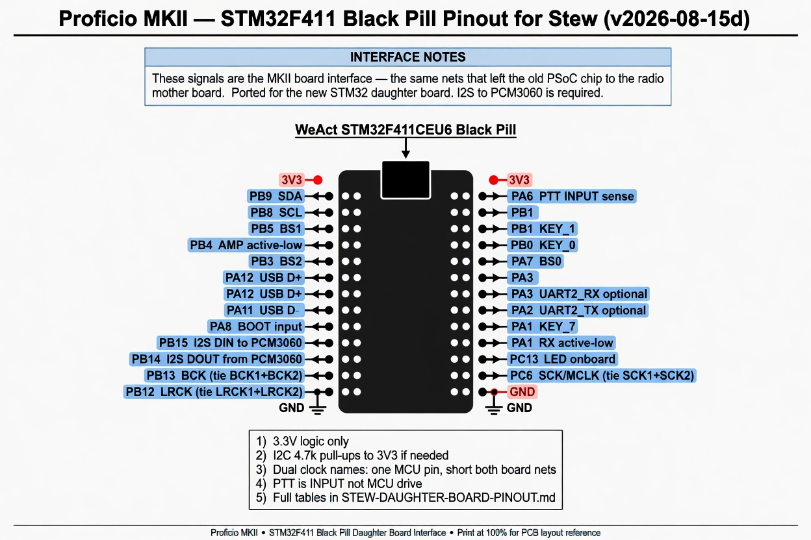

# Proficio MKII — Daughter board pinout for Stew

> **Doc version: 2026-08-15d**

**Send Stew these two files:**

| File | Role |
|------|------|
| `STEW-DAUGHTER-BOARD-PINOUT.md` | **Authoritative tables** (this file) |
| `STEW-BlackPill-pinout-diagram.jpg` | Overview diagram |

**Folder:** `proficio-stm32f411\docs\`  
(on Ron’s PC: `C:\Users\Ron\.grok\worktrees\proficio-stm32f411\docs\`)

---

## Read this first (what “yellow nets” means)

The old MCU was a **Cypress PSoC 3**. Its firmware was designed in **PSoC Creator**. In screenshots of that design, the signals that **leave the chip and go to the rest of the MKII radio** were highlighted in **yellow**.

| Term in these docs | Plain meaning for layout |
|--------------------|---------------------------|
| **Yellow net** / **yellow pin** | A real board signal name from the existing MKII (DIN, BCK1, KEY_0, …) |
| **Mother board** | The main MKII radio board those signals connect to |
| **This document** | Same signal list, reassigned to a **new STM32F411** daughter board |

**You do not need PSoC Creator.**  
**Your PCB is not yellow.**  
“Yellow” only means: *this net was on the old chip’s external pin list — keep the same radio connection, new MCU pin.*

**Goal of the daughter board:** replace the PSoC with an STM32F411 module while preserving those radio/codec/control interfaces. **I2S to the PCM3060 is required** for audio.

**MCU:** WeAct **STM32F411CEU6** Black Pill (or bare F411)  
**Logic:** **3.3 V** GPIO only · common **GND**  
**Firmware pin macros:** `firmware/pio/include/board_pins.h`



---

## 1. MKII interface signals (complete pin list)

Same nets that left the old PSoC to the radio. Map them to the STM32 pins below.

| Signal (MKII net name) | Dir (MCU) | STM32 | Notes |
|------------------------|-----------|-------|--------|
| **DOUT** | in | **PB14** | From PCM3060 → I2S2ext_SD |
| **DIN** | out | **PB15** | I2S2_SD → to PCM3060 |
| **BCK1** | out | **PB13** | I2S2_CK; **tie to BCK2** on PCB |
| **BCK2** | out | *(same PB13)* | PSoC both from I2S `sck` |
| **LRCK1** | out | **PB12** | I2S2_WS; **tie to LRCK2** on PCB |
| **LRCK2** | out | *(same PB12)* | PSoC both from I2S `ws` |
| **SCK1** | out | **PC6** | I2S2_MCK; **tie to SCK2** on PCB |
| **SCK2** | out | *(same PC6)* | Codec sysclk |
| **SDA** | OD | **PB9** | I2C1 |
| **SCL** | OD | **PB8** | I2C1 |
| **BS0** | out | **PA7** | Band bit0 |
| **BS1** | out | **PB5** | Band bit1 |
| **BS2** | out | **PB3** | Band bit2 |
| **LED1** | out | **PC13** | On Black Pill (active low) |
| **RX** | out | **PA1** | Active low (PA / T-R) |
| **AMP** | out | **PB4** | Active low |
| **BOOT** | in | **PA8** | Status / bootload sense — **included** |
| **KEY_0** | in | **PB0** | Pull-up; low = key down |
| **KEY_1** | in | **PB1** | Pull-up; low = key down |
| **PTT** | **in** | **PA6** | Sense (PSoC: invert + debounce); active-low assumed |

**USB:** PSoC USBFS pins → use **Black Pill USB-C** (PA11/PA12) to host for bring-up.

**Not yellow external data pins:** PSoC `CONTROL_DIN` / `CONTROL_DOUT` register bits gate fabric (AND into DIN path). They are **not** the I2S DIN/DOUT nets. Software shadow only unless schematic shows extra enable pins.

---

## 2. I2S (heart of audio)

PSoC: **one I2S Master**, full duplex:

```text
  PCM3060 DOUT ──► DOUT pin ──► I2S sdi  (RX IQ into MCU)
  I2S sdo ──► (gate) ──► DIN pin ──► PCM3060 DIN  (TX IQ out)
  I2S sck ──► BCK1 and BCK2
  I2S ws  ──► LRCK1 and LRCK2
  (sysclk) ──► SCK1 and SCK2
```

STM32: **I2S2 + I2S2ext** (shared BCK/LRCK).

| Function | STM32 pin | AF |
|----------|-----------|-----|
| LRCK | PB12 | I2S2_WS |
| BCK | PB13 | I2S2_CK |
| DIN (→ codec) | PB15 | I2S2_SD |
| DOUT (← codec) | PB14 | I2S2ext_SD |
| MCLK / SCK | PC6 | I2S2_MCK |

Daughter board: short **BCK1–BCK2**, **LRCK1–LRCK2**, **SCK1–SCK2** to the single driver each.

---

## 3. Inputs detail

| Net | STM32 | PSoC behavior | STM32 FW |
|-----|-------|---------------|----------|
| KEY_0 / KEY_1 | PB0 / PB1 | Debouncer → Status | Pull-up; software debounce later if needed |
| **PTT** | **PA6** | **Input** → inverter → debouncer → Status | Input, active-low → `E_PTT` / `STATUS_PTT` |
| **BOOT** | **PA8** | Status bit | Input; high = STATUS_BOOT |

---

## 4. Band codes (BS2:BS1:BS0)

| Group | Code | BS2 | BS1 | BS0 |
|-------|------|-----|-----|-----|
| 10/12 m | 0x00 | 0 | 0 | 0 |
| 15/17 m | 0x01 | 0 | 0 | 1 |
| 20/30 m | 0x02 | 0 | 1 | 0 |
| 40/60 m | 0x03 | 0 | 1 | 1 |
| 80 m | 0x04 | 1 | 0 | 0 |
| 160 m | 0x05 | 1 | 0 | 1 |

---

## 5. PCB checklist

1. Route **all MKII interface signals** in §1 (including **I2S** and **BOOT**).  
2. Tie dual clock names (BCK/LRCK/SCK ×2) as above.  
3. I2C pull-ups 4.7 kΩ to 3.3 V if needed.  
4. PTT is **input** (sense), not a drive output.  
5. AMP/RX active-low polarity match MKII.  
6. 3.3 V only into STM32 I/O.  
7. ST-Link + USB-C accessible on module.

---

## 6. Open questions

- [ ] Confirm PTT polarity after PSoC inverter vs MKII footswitch wiring.  
- [ ] Confirm SCK1/SCK2 frequency (I2S MCLK vs fixed clock).  
- [ ] Any discrete CONTROL_DIN/DOUT enable pins on schematic beyond I2S?

---

**Version:** 2026-08-15d — plain-English “yellow nets” explanation for Stew; BOOT=PA8; PTT=input PA6  
